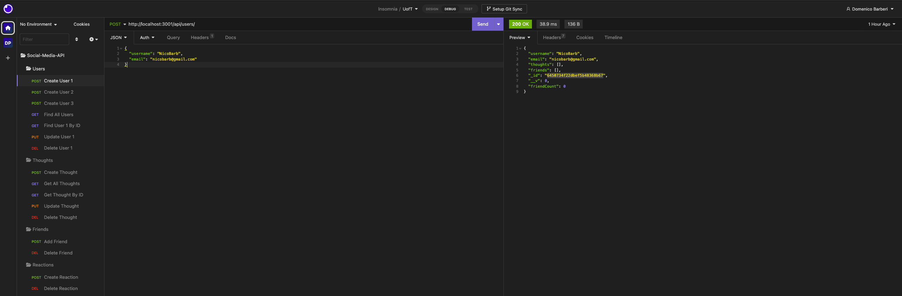

# Social-Network-API

## Description:
A NoSQL database API for a social network web application where users can share their thoughts, react to friends’ thoughts, and create a friend list. This application uses Express.js for routing, a MongoDB database, and the Mongoose ODM.

## Table of Contents:

* [Installation](#installation)
* [Usage](#usage)
* [License](#license)
* [Questions](#Questions)
* [Email](#Email)
* [Github](#Github)
* [Owner](#Owner)

## Installation
***Requirments***

[Node.js](https://nodejs.org/en/) | [MongoDB](https://www.mongodb.com/) | [Mongoose](https://www.npmjs.com/package/mongoose) | [Express](https://www.npmjs.com/package/express)

## Usage:

1. Clone the Repository on to your machine.
2. Navigate to the root directory of the project in the terminal.
3. Run the command ```npm i``` to download the packages.
4. Then run the command ```node start``` to run the software.
5. The application will then begin to run locally.

## Screenshot:


## Video Demo:
https://user-images.githubusercontent.com/119437696/235577227-f3138229-8742-4f11-973c-fc42de6c68c9.mp4

## License

This project is licensed under the MIT license. Click [here](https://opensource.org/licenses/MIT) for more information.<br>


## Questions:
## Email:
If you have any questions email me directly at domenicoabarberi@gmail.com.

## Github:
Please visit my [GitHub](https://github.com/DomenicoBarb) to view my other work.

## Owner:
Nico Barberi
